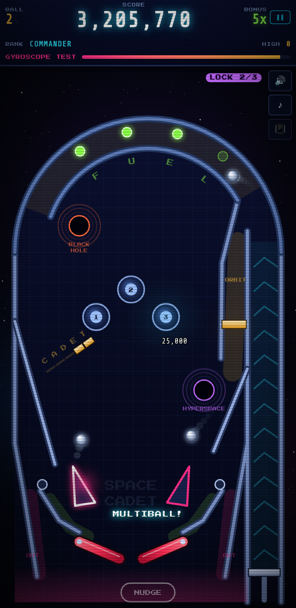

# 3D Space Cadet Pinball

A retro space-pinball table in the spirit of the 90s Windows classic, rebuilt
from scratch to run in a browser. Full rigid-body physics, procedurally drawn
neon playfield, synthesised sound, and touch controls designed for a phone.

No build step, no dependencies to install, no assets to download — open
`index.html` and it runs.



## Play

**On a phone.** Tap the left or right half of the table to work that flipper;
both at once works. Hold **LAUNCH** to wind up the plunger and let go to fire.
**NUDGE** shoves the cabinet — three shoves in quick succession and you tilt.
Tap 📳 once to allow motion access and you can shake the phone to nudge instead.

**On a desktop.** `←` `→` (or `Z` `/`) for the flippers, `space` for the
plunger, `shift` to nudge, `P` to pause, `Enter` to start.

You get three balls, with a ten-second ball save at the start of each one.

## The table

| Shot | What it does |
| --- | --- |
| **Jet bumpers** | Fast points. Shoot straight up the middle to get into the nest. |
| **C‑A‑D‑E‑T targets** | Drop all five to light the **kickback**, which saves one ball from the left outlane. |
| **F‑U‑E‑L lanes** | Four rollovers spaced around the orbit channel. Loop the ball right round the dome to light all four and raise the bonus multiplier, up to 5×. |
| **Hyperspace** | 50,000, then the ball is spat out over the jet bumpers. |
| **Black hole** | 35,000, and it **locks a ball**. Lock three and the saucer kicks out into **multiball**. It sits under the arch — a straight shot up the middle-left. |
| **Orbit spinner** | At the top of the right orbit. Every loop round the dome rips it. |
| **Slingshots / posts** | Small points and a lot of chaos. |

A full-power plunge sends the ball round the dome and down the left return
guide, lighting all four fuel lanes on the way — that's the skill shot.

### Ranks and missions

Each mission completed earns a promotion:

> CADET → ENSIGN → LIEUTENANT → CAPTAIN → COMMANDER → ADMIRAL → FLEET ADMIRAL

The missions cycle through the jet bumpers, the target bank, the fuel lanes,
hyperspace, the black hole, the spinner, and finally **Multiball Madness**.
Reaching Commander awards an extra ball.

Multiball does not depend on that ladder, though — shoot the black hole
three times in a game and the third kick-out gives you three balls at once.
Working through all six missions first would make it nearly unreachable.
End-of-ball bonus is everything you hit that ball, times your multiplier.

## Deploying to GitHub Pages

The repository *is* the site — there is nothing to build, so no deploy
workflow is needed. Settings → Pages → Source: *Deploy from a branch* →
`main` / `/ (root)`, and GitHub publishes the repo as-is on every push.

The game then lands at `https://<user>.github.io/pinball-game/`.

`.nojekyll` is in the root so Pages serves every file verbatim instead of
running the contents through Jekyll first.

### Adding it to an iPhone home screen

Open the page in Safari → Share → **Add to Home Screen**. It launches
fullscreen with no browser chrome.

Bootstrap, the webfonts and every sound are bundled or synthesised locally,
so the whole game is a handful of same-origin requests with no third-party
dependency to go down. That is not the same as true offline support: there
is no service worker, so a cold launch with no connection depends on
whatever iOS still holds in its HTTP cache. Registering one would make it
genuinely offline-capable, at the cost of having to manage cache
invalidation on every update.

## Running locally

ES modules need to be served over HTTP, so opening the file directly won't
work. Any static server will do:

```sh
python3 -m http.server 8000
# then open http://localhost:8000
```

## How it is built

Plain JavaScript modules, no framework and no bundler. Bootstrap handles the
shell (score bar, panels, buttons); everything inside the playfield is drawn
to a canvas.

```
index.html              markup + HUD
css/style.css           retro shell over Bootstrap
css/fonts.css           self-hosted webfaces
vendor/bootstrap.min.css
js/physics.js           ball vs. segments, circles and swinging flippers
js/table.js             the playfield: every wall, target, lane and hole
js/game.js              rules, scoring, missions, the fixed-timestep loop
js/renderer.js          all the artwork, drawn procedurally
js/audio.js             every sound, synthesised at runtime
js/input.js             multi-touch, keyboard, shake-to-nudge
js/main.js              boot, resize, render loop, HUD
```

A few things worth knowing if you want to change it:

- **The table is data.** `createTable()` in `js/table.js` returns plain lists of
  walls, circles, targets, lanes and holes in a 560 × 1000 coordinate space
  that the renderer scales to the screen. Move a wall and both the physics and
  the artwork follow.
- **Missions are data too.** Each entry in `MISSIONS` maps event names to
  progress, so a new objective is a few lines in `js/game.js`.
- **Physics runs on substeps** sized so the ball can never travel more than
  about half its radius per step — that is what stops a 2,400-unit/second ball
  tunnelling through a wall.
- **Flippers carry their contact point's velocity** into the collision, which
  is where all the power in the game comes from.
- **The static playfield is cached** to an offscreen canvas and only rebuilt on
  resize, so each frame redraws just the moving parts. It holds 60fps on a
  phone.

Geometry is fussier than it looks. The lane widths are all checked against the
22-unit ball diameter: outlane mouths are wide enough to swallow a ball, and
the gaps between the inlane rails and the flippers are deliberately too narrow.
Several comments in `table.js` mark places where an obvious-looking change
reintroduces a trap.

## Credits

Inspired by *3D Pinball for Windows – Space Cadet* (Maxis / Cinematronics,
1995). No code or assets from the original are used; everything here is
original.

Fonts: [Press Start 2P](https://fonts.google.com/specimen/Press+Start+2P) and
[Share Tech Mono](https://fonts.google.com/specimen/Share+Tech+Mono), both
SIL Open Font License 1.1. [Bootstrap 5.3.3](https://getbootstrap.com), MIT.
